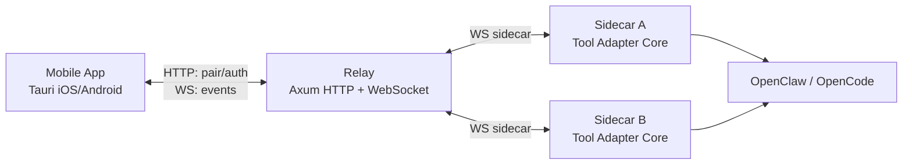

# yourConnector

`yourConnector` 是一套面向 `Mobile App -> Relay -> Sidecar -> OpenClaw/OpenCode` 的连接与能力编排系统。

## 1. 项目介绍

项目核心目标是把“配对接入、宿主运维、工具控制、聊天、报告读取”放在同一条可治理链路里，而不是拆成多个互不一致的小工具。

它要解决的具体问题是：

1. 在手机端统一接入并管理多台宿主机。
2. 在不暴露 `pairToken` 给 App 的前提下完成安全配对与会话换发。
3. 在同一套事件协议中收敛工具接入、详情采集、聊天与报告读取。

边界说明：

1. 这不是单一 IM 或单一工具的“页面插件”，而是独立的连接层与运维层。
2. Relay 只做配对、鉴权与路由，不执行工具命令。
3. 工具执行、详情采集、聊天和报告读取全部在 Sidecar 完成。

## 2. 项目能力矩阵（按代码事实）

| 能力域 | 当前能力 | 代码入口 |
| --- | --- | --- |
| 配对与宿主机接入 | `pairTicket` 流程、三入口配对（扫码/链接/手动）、会话安全落盘、多宿主自动连接 | `app/mobile/ui/js/flows/pairing-*.js` `services/relay/src/pairing/*` |
| 运维页 | 宿主机 Banner、连接/重连、工具接入/断开、控制端重绑、宿主机删除补偿 | `app/mobile/ui/js/flows/connection-*.js` `host-manage.js` `tool-manage.js` |
| 聊天页 | 会话列表/详情/完整消息三态、消息队列、取消生成、会话本地持久化 | `app/mobile/ui/js/flows/chat.js` `app/mobile/src-tauri/src/lib.rs` |
| 报告读取 | 通过 `tool_report_fetch_*` 拉取 Markdown 报告、进度与错误可视化 | `app/mobile/ui/js/modals/report-viewer.js` `services/sidecar/src/session/loop/report.rs` |
| 工具详情页 | `openclaw.v1` 五屏详情、`opencode.v1` 详情卡片、过期数据 `stale` 回退 | `app/mobile/ui/js/modals/tool-detail.js` `services/sidecar/src/tooling/adapters/*` |
| 发布与部署 | Linux/macOS 分发脚本、GitHub Release、OSS 同步、Android APK Release | `scripts/dist/*` `.github/workflows/*` |

## 3. 架构总览



架构细节见 `docs/架构与数据流.md`。

## 4. 仓库结构

1. `app/mobile`：移动端（页面 + Tauri 原生命令）。
2. `services/relay`：配对、鉴权、WS 转发。
3. `services/sidecar`：工具发现、详情采集、控制、聊天、报告。
4. `protocol/rust`：共享 envelope 与 payload 结构。
5. `scripts`：配对辅助、分发安装、质量门禁脚本。
6. `docs`：单版本中文文档系统。

## 5. 本地快速开始

### 5.1 前置环境

1. Rust + Cargo。
2. Node.js（用于 `app/mobile/ui/js` 语法检查）。
3. iOS 调试：Xcode / `xcrun`。
4. Android 调试：Android SDK / `adb`。

### 5.2 启动服务

```bash
make run-relay
make run-sidecar
```

健康检查：

```bash
curl -sS http://127.0.0.1:18080/healthz
curl -sS http://127.0.0.1:18081/healthz
```

### 5.3 启动移动端（iOS 示例）

```bash
make run-mobile-tauri-ios IOS_SIM="iPhone 17 Pro"
```

### 5.4 配对调试

```bash
make show-pairing
make show-pairing-link
make simulate-ios-scan
make simulate-android-scan ANDROID_DEVICE="emulator-5554"
```

## 6. 部署方式

### 6.1 A 机（Relay + Sidecar）

```bash
sudo bash scripts/dist/yc-relay.sh install \
  --acme-email you@example.com \
  --public-ip <A公网IPv4>

sudo bash scripts/dist/yc-sidecar.sh install \
  --relay-ip <A公网IPv4>
```

### 6.2 B 机（仅 Sidecar）

```bash
sudo bash scripts/dist/yc-sidecar.sh install \
  --relay-ip <A公网IPv4>
```

说明：`scripts/dist/yc-sidecar.sh` 当前推荐使用 `--relay-ip`，脚本会拼接 `wss://<ip>/v1/ws`。

## 7. 文档入口（代码优先）

1. 总导航：`docs/文档导航.md`
2. 代码事实总索引：`docs/代码事实总索引.md`
3. 配对能力：`docs/配对与宿主机接入/`
4. 运维能力：`docs/运维与工具管理/`
5. 聊天能力：`docs/聊天与报告/`
6. 工具详情能力：`docs/工具详情与数据采集/`
7. 协议与部署：`docs/API与事件协议.md` `docs/CLI与环境变量.md` `docs/分发安装与卸载.md`

## 8. 质量门禁

```bash
make check-governance
make check-all
```

## 9. 当前实现约束（重要）

1. App 不支持 `pairToken` 直连配对或 WS，必须走 `pairTicket -> access/refresh + PoP`。
2. 移动端自动重连固定为 `2s` 间隔，最多 `5` 次，超限转手动重连。
3. 工具进程控制中，`restart` 当前仅支持 OpenClaw；OpenCode 仅支持 `stop`。
4. 聊天队列上限为每会话 `20` 条（含运行中请求）。
5. 报告读取仅允许“当前工具工作区内的绝对路径 `.md` 文件”。
