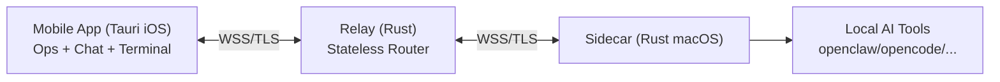

# yourConnector MVP 架构设计 v0

## 1. 目标与范围

### 1.1 产品目标
- 做一个 `运维 + 聊天` 一体化的移动端 IM 工具。
- 用户离开电脑时，仍可在手机上管理并使用本机 AI 工具（openclaw/opencode/codex/claude code 等）。
- 工具动作与输出由 sidecar 执行并忠实转发。

### 1.2 MVP 范围
- 单台 macOS 内多工具接入。
- 自动发现范围仅限“已接入 sidecar 的工具”。
- relay 负责鉴权与路由，业务正文不落库。
- 支持 Tools 运维页、工具会话页、可输入终端交互。
- 暂不做真人好友体系。

## 2. 技术栈

- App：`Tauri Mobile + Rust`（iOS）
- Relay：`Rust`（`services/relay`）
- Sidecar：`Rust`（`services/sidecar`）
- 协议：`protocol/rust` + `protocol/schema`

## 3. 核心约束

- `忠实转发`：不改写用户输入与工具输出语义
- `relay 不落库`：不持久化聊天正文、终端输出、附件内容
- `白名单执行`：系统级 + 角色级命令白名单
- `断线可恢复`：会话支持 seq 续流

## 4. 总体架构

## 5. 里程碑

1. M1：relay + sidecar 在线与工具发现
2. M2：Tools 运维页闭环
3. M3：聊天与 agent 事件流
4. M4：可输入终端与重连续流
